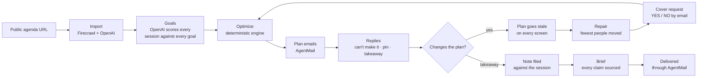
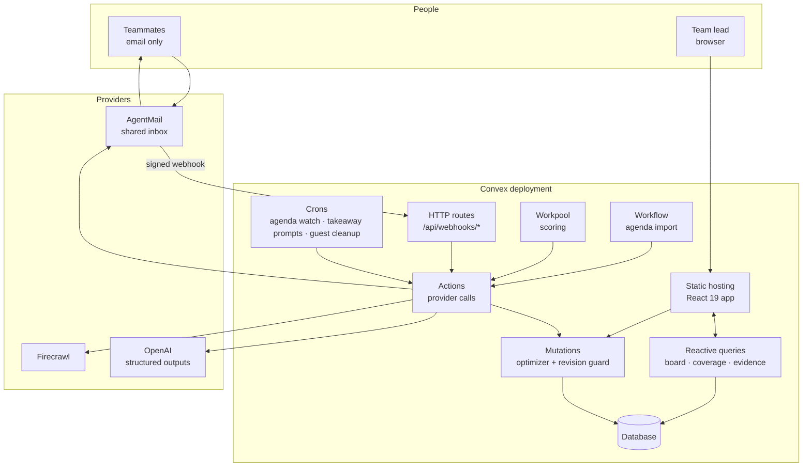
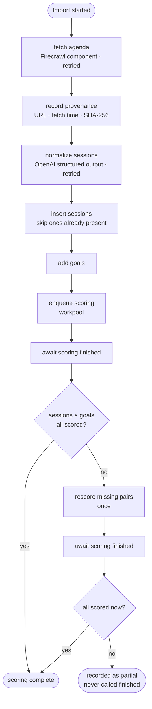
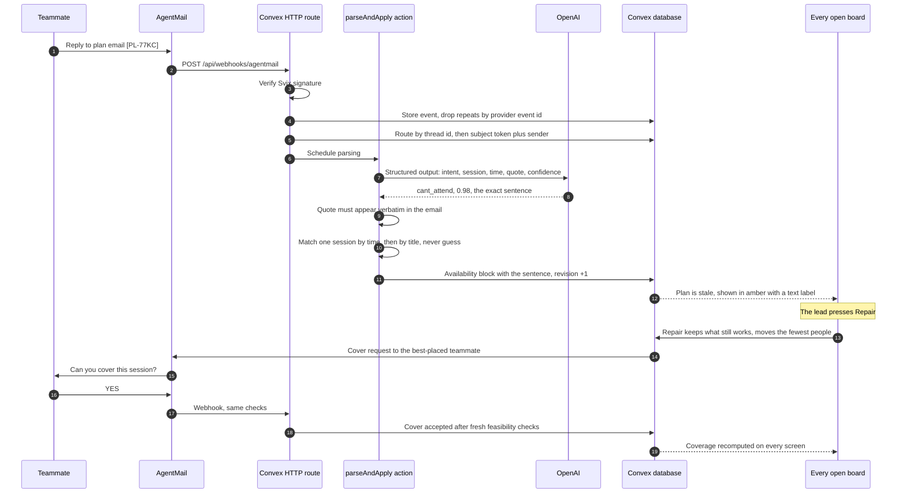
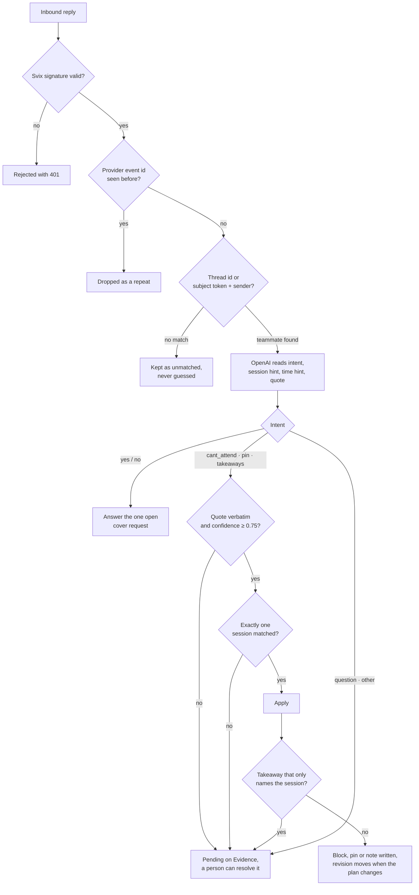
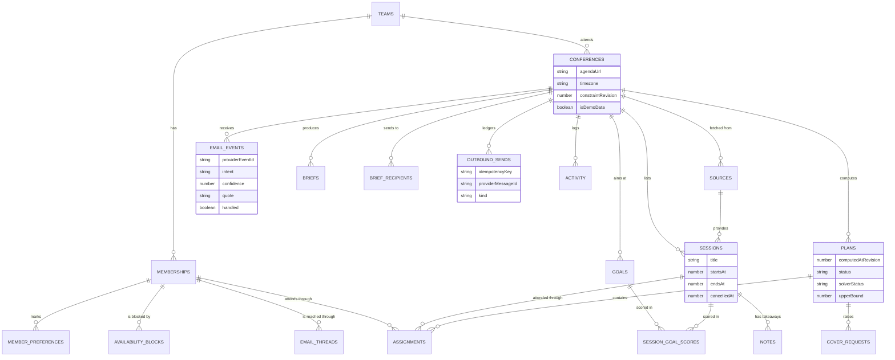

# Parallel

[](https://github.com/Enoch208/parallel/actions/workflows/ci.yml)

**Send four people to a conference. Make sure they don't all learn the same thing.**

Parallel turns a public conference agenda into one coordinated team plan, repairs that plan when
real life gets in the way, and brings the learning home as a single brief in which every claim
cites its source. Teammates never open the app: the plan arrives by email and changes come back as
ordinary replies.

https://github.com/user-attachments/assets/19891333-4520-40de-a375-207f92427ae2

- **Live app:** https://joyous-akita-768.convex.site
- **Judge path:** [`/judges`](https://joyous-akita-768.convex.site/judges) runs the whole loop on a
  workspace of your own, then lets you try to break it
- **Verified real run:**
  [the production board](https://joyous-akita-768.convex.site/board?c=js711hd3g819z5kw11bv8ntqm58erbt5)
- **Submission notes:** [`hackathon.md`](hackathon.md)

---

## Contents

- [The problem](#the-problem)
- [What Parallel does](#what-parallel-does)
- [How it works](#how-it-works)
- [Architecture](#architecture)
- [The email loop](#the-email-loop)
- [The optimizer](#the-optimizer)
- [What the model does, and what it never does](#what-the-model-does-and-what-it-never-does)
- [Guarantees](#guarantees)
- [The verified production run](#the-verified-production-run)
- [Screens](#screens)
- [Data model](#data-model)
- [Tech stack](#tech-stack)
- [Running it yourself](#running-it-yourself)
- [Testing](#testing)
- [Project layout](#project-layout)
- [Known limitations](#known-limitations)
- [Licences](#licences)

---

## The problem

Sending a team to a multi-track conference is expensive, and most of the return leaks away. Left to
themselves, everyone picks the same famous keynotes, whole tracks go unwatched, and the notes come
home in four separate notebooks. Teams already try to divide and conquer in spreadsheets and group
chats, and the plan falls apart the moment the day does: a meeting runs over, a session moves, and
nobody knows who should cover what.

## What Parallel does

Parallel maximizes what a whole team learns rather than optimizing one person's calendar.

On the production run below, five teammates who each attended only the sessions they had marked
for themselves would have scored **15.5** on Team Goal Coverage. The coordinated plan scores
**91.1**, across all 9 sessions on that day's agenda.

The product rests on one boundary:

> **AI understands the conference. Deterministic code decides who goes where.**

The model reads agenda pages, scores relevance, reads email and writes prose. It never does
schedule math, never picks who attends what, never computes coverage and never decides whether a
plan is feasible. That is deterministic TypeScript, checked by property tests against brute force.

## How it works



1. **Import the conference.** Paste a public agenda URL. The import runs as a durable Convex
   workflow: Firecrawl scrapes the page, the source URL, fetch time and SHA-256 content hash are
   recorded, OpenAI normalizes the markdown into sessions, and the sessions are written. A failure
   halfway through resumes instead of starting over, and the screen shows which step is running.
2. **Say what the team came to learn.** The lead adds weighted goals. OpenAI scores every session
   against every goal from 0 to 1 and stores a one-line reason and the model name with each score.
   The workflow checks that the score matrix is complete, rescores missing pairs once, and records
   a partial import as partial rather than finished.
3. **Optimize.** One click splits the team across overlapping sessions. Nobody is in two places at
   once, nobody is assigned over a block they recorded, and a pinned session is never silently
   dropped. If the pins cannot all fit, the plan is marked infeasible and the blocking pins are
   named.
4. **Send everyone their plan.** Each teammate receives their own schedule from one shared
   AgentMail inbox, with a `[PL-XXXX]` token in the subject so a reply can be routed back to them.
5. **Handle real life by email.** A teammate replies in their own words: _"I can't make the 11:30
   workshop."_ The reply is verified, parsed, matched to a session and applied as an availability
   block. The constraint revision moves, and every open board turns stale at once.
6. **Repair, then ask for cover.** Repair keeps every assignment that still works and moves as few
   people as possible. If a session is left open, Parallel ranks who should cover it, shows the
   arithmetic for why, and emails that person. They reply **YES** or **NO**.
7. **Bring the learning home.** Teammates reply with what they took from a session. Each takeaway
   is filed against the right session, the lead can reject any of them, and OpenAI writes a brief
   grouped by goal in which every claim must cite an approved takeaway or an agenda session.
   AgentMail delivers it to the lead and to anyone the lead adds by hand.

## Architecture

The whole product is one Convex deployment. The React app is served from `convex.site` by the
static-hosting component, every screen subscribes to reactive queries, and the optimizer runs
inside the mutation that writes the plan, so a plan and the constraints it was built from are
committed in the same transaction.



Mutations never make network calls. Everything that talks to Firecrawl, OpenAI or AgentMail is an
action, and actions change state only by calling mutations, so every write is a transaction that
re-checks its own rules.

### Where each sponsor fits

| Sponsor       | What it does in Parallel                                                                                                                             | Where                                                                      |
| ------------- | ---------------------------------------------------------------------------------------------------------------------------------------------------- | -------------------------------------------------------------------------- |
| **Convex**    | Database, reactive queries, the optimizer inside the plan-writing mutation, the revision guard, webhooks, crons, four components and the site itself | `convex/plan.ts`, `convex/assignments.ts`, `convex/http.ts`                |
| **Firecrawl** | Scrapes the public agenda through the official Convex component and re-checks watched agendas for changes                                            | `convex/model/firecrawlComponent.ts`, `convex/agendaWatch.ts`              |
| **OpenAI**    | Normalizes agenda markdown, scores session relevance, parses email replies, writes the brief                                                         | `convex/model/openaiClient.ts`                                             |
| **AgentMail** | One shared inbox: plan emails, cover requests and the brief go out; replies come back through a Svix-verified webhook                                | `convex/model/agentmailClient.ts`, `convex/emailSend.ts`, `convex/http.ts` |

### Convex components

| Component                     | What it carries                                                                                                         |
| ----------------------------- | ----------------------------------------------------------------------------------------------------------------------- |
| `@convex-dev/static-hosting`  | Serves the built Vite app from `convex.site` with SPA fallback, so the product is a single deployment                   |
| `@convex-dev/workflow`        | Runs the agenda import as named, durable steps; the provider steps retry with backoff and the UI shows the current step |
| `@convex-dev/workpool`        | Runs scoring in its own pool, two at a time with up to three attempts, so a long scoring run never starves the backend  |
| `@firecrawl/firecrawl-convex` | Does the scraping, with its API key declared as component environment rather than read from the outer deployment        |

`@agentmail/convex` was evaluated and rejected. Its `defineComponent("agentmail")` declares no
`env` block, so `process.env.AGENTMAIL_API_KEY` is undefined inside the component sandbox whatever
is set on the deployment, and every send failed with `AGENTMAIL_API_KEY is not set`. AgentMail is
called directly over its REST API instead, and inbound mail lands on our own HTTP route with its
Svix signature verified in `convex/model/svix.ts`.

### The agenda import



Scores carry an input fingerprint. Re-importing an unchanged agenda reuses every current score and
spends nothing on the model (`convex/scoringReuse.ts`).

## The email loop

Email is the interface. There is one shared AgentMail inbox, and every inbound message goes
through the same checks before it is allowed to touch a plan.



### How a reply is judged



- **Routing.** Thread id first, then the `[PL-XXXX]` subject token together with the sender's
  address. Anything that matches neither is kept and shown, never attached to a guess.
- **Session matching.** A time is tried first and must match exactly one session starting within
  30 minutes of it. Otherwise the session hint must be a contiguous piece of one title, or every
  significant word of it must appear in exactly one title. Two candidates means no match.
- **Consent.** A teammate's own "can't make it" applies at once. Anything that changes someone
  else's day needs their YES or the lead's click. Operational email never leaves the team; the
  brief goes only to the lead and the recipients the lead adds.
- **Sending.** Plan and cover emails are keyed on kind, teammate and plan revision, and the brief on
  brief and recipient, so a retry never sends twice. Every send counts against a rolling 24-hour
  budget of 80 so a loop cannot drain the inbox.
- **Resolving by hand.** A reply the parser would not apply stays on the Evidence screen, where a
  person can apply it to a session. The original email is kept and the change is recorded as
  resolved by hand, not by the parser.

## The optimizer

`convex/engine/` is pure TypeScript with no network access and no Convex imports, so the same code
runs inside a mutation and inside the test suite.

### Team Goal Coverage

For each goal _g_, over the unique sessions the team attends:

```text
coverage(g)        = 1 − Π (1 − 0.75 · r(s, g))
Team Goal Coverage = 100 · Σ w_g · coverage(g) / Σ w_g
```

`r(s, g)` is the model's relevance score for session _s_ against goal _g_, and `w_g` is the goal's
weight. The product term gives diminishing returns: a fourth similar session on the same goal adds
less than the first. The score runs from 0 to 100 and is never shown as a percentage.

Beside it the board shows two literal counts: **unique sessions assigned**, against the most the
team could physically attend, and **duplicate attendances**, which are reported rather than
forbidden. "The most the team could physically attend" is computed exactly as a k-track interval
scheduling problem in `convex/engine/attendable.ts`.

Coverage is a reactive query derived from the stored assignments. Nothing trusts a stored number.

### The objective

```text
objective = Team Goal Coverage
          + 0.25 × sessions a teammate marked as interesting and attends
          − 0.5  × duplicate attendances
          − 3    × assignments changed from the current plan   (repair only)
```

These constants live in `convex/engine/constants.ts`. They were fixed before any result was looked
at and are never tuned to reach a number.

### Search, and what it can prove

| Mode                   | When                                               | What the product reports                                                         |
| ---------------------- | -------------------------------------------------- | -------------------------------------------------------------------------------- |
| Exact branch-and-bound | Search space at most 2⁴⁰ and within 120,000 nodes  | **Proven optimal**                                                               |
| Beam search, width 100 | Anything larger, or when the exact budget runs out | **Best found**, with a derived upper bound so the largest possible gap is stated |

Hard constraints are never traded for score: no double booking, no assignment over a recorded
block, and no silently dropped pin. A plan with conflicting pins is returned as infeasible with the
blocking pins named.

### Repair, not reshuffle

Mid-event, a team wants the fewest people moved. Repair charges 3 points for every assignment that
differs from the current plan, so a plan that moves one person beats a slightly higher score that
moves four. A separate analysis (`repairWithMinimumDisruption`, 150,000-node budget) identifies the
minimum set of teammates whose schedules cannot stay as they are. The saved repair keeps only the
previous plan's assignments that survive; new assignments for other people wait for their consent
through a cover request.

### The revision guard

```mermaid
stateDiagram-v2
    state "Plan current<br/>plan revision = conference revision" as Current
    state "Plan stale<br/>shown in amber with a text label" as Stale
    state "Write refused<br/>'The plan changed while you were looking at it'" as Refused

    [*] --> Current : Optimize
    Current --> Stale : reply · pin · block · agenda change
    Stale --> Current : Repair or Optimize
    Stale --> Refused : a browser writes against the old revision
    Refused --> Stale : reload and try again
    Current --> Current : claim or release by hand
```



Every constraint change bumps `constraintRevision` on the conference. A plan stores the revision it
was computed at, and every write re-reads it at the moment of the write. A write against a stale
plan is rejected with a message that says what to do, never merged silently. Claiming a session by
hand and accepting a cover by email run through the same guard in
`convex/model/assignmentGuards.ts`.

## What the model does, and what it never does

Every model call uses OpenAI structured outputs with a JSON schema, and every result is validated
before it is stored.

| Job                  | Input                             | Output                                             | Guard                                                                   |
| -------------------- | --------------------------------- | -------------------------------------------------- | ----------------------------------------------------------------------- |
| Normalize the agenda | Scraped markdown for one day      | Sessions with title, time, room, speakers          | Times are validated in the event's time zone; invalid rows are dropped  |
| Score relevance      | Sessions and goals                | A 0 to 1 score and a one-line reason per pair      | The matrix is checked for completeness; missing pairs are rescored once |
| Parse replies        | One email body                    | Intent, session hint, time hint, quote, confidence | The quote must be a verbatim substring of the email, confidence ≥ 0.75  |
| Write the brief      | Approved takeaways and the agenda | Claims grouped by goal, each naming its source     | Claims citing an unknown note or session are dropped and counted        |

It never assigns anyone, never computes coverage, never decides feasibility and never invents a
number. The model's name is stored with every score and every brief.

## Guarantees

Each of these is enforced in code and covered by tests. The first four can be attacked live from
**Try to break it** on `/judges`, which runs them through the production code on a throwaway
workspace and deletes it afterwards.

| Guarantee                                                  | How                                                                                          | Where                                                  |
| ---------------------------------------------------------- | -------------------------------------------------------------------------------------------- | ------------------------------------------------------ |
| A webhook delivered twice is stored once                   | Events are keyed by the provider's event id                                                  | `convex/emailIngest.ts`                                |
| A browser holding an old plan cannot overwrite a newer one | Revision re-read at write time                                                               | `convex/model/assignmentGuards.ts`                     |
| A paraphrased model quote is never acted on                | Verbatim substring check before anything is applied                                          | `convex/model/replySchema.ts`                          |
| A retried send never delivers twice                        | Idempotency key on kind, teammate and revision, checked in a ledger before the provider call | `convex/emailSendWrites.ts`                            |
| A send loop cannot drain the inbox                         | Rolling 24-hour budget of 80 sends                                                           | `convex/emailSend.ts`                                  |
| An ambiguous reply is never guessed                        | Session matching requires exactly one candidate                                              | `convex/model/sessionMatch.ts`                         |
| An empty takeaway never reaches the brief                  | A takeaway needs at least four words beyond the session title; rejected notes are excluded   | `convex/model/takeawaySubstance.ts`, `convex/brief.ts` |
| A cancelled session is never assigned                      | Planning input drops it; repair drops assignments that pointed at it                         | `convex/model/loadOptimizerInput.ts`                   |
| Nobody else's day changes without consent                  | New assignments for others only through an accepted cover request                            | `convex/model/coverAcceptance.ts`                      |
| A guest's clicks never touch another visitor's board       | Each guest gets a workspace of their own, removed after 24 hours                             | `convex/guest.ts`                                      |

## The verified production run

One permanent workspace on production holds a complete run on the public
[ViVE 2026 agenda](https://www.viveevent.com/agenda/). Parallel is unofficial and not affiliated
with the event. Nothing in the workspace is seeded.

| Step                                             | Measured on production                                                |
| ------------------------------------------------ | --------------------------------------------------------------------- |
| Sessions imported by Firecrawl and OpenAI        | 9, each with source URL, fetch time and SHA-256 hash                  |
| Relevance scores                                 | 36 of 36, recorded with `gpt-5.4-mini`                                |
| First plan                                       | Team Goal Coverage 90.5 across 9 unique sessions                      |
| A teammate replies that he cannot make a session | Parsed as `cant_attend` at 0.98 confidence, sentence stored verbatim  |
| Repair                                           | **One** person moved; 90.5 → 88.8, the open session shown, not hidden |
| Cover request by email, answered YES             | Back to 90.5 across 9 unique sessions                                 |
| Takeaway by email                                | Filed against the covered session                                     |
| Brief                                            | Written from the approved takeaway and delivered through AgentMail    |

The board reads **91.1** today rather than 90.5. One of the 36 session-and-goal pairs had no model
output when the run took place, and scoring it afterwards completed the matrix.

The email is real: two real inboxes, real replies, a verified webhook and real deliveries. The
conference is played out, since nobody on the team attended ViVE 2026, so the reasons in the
replies and the takeaway were written for the run. The other three teammates are placeholders
whose addresses do not receive mail, and the board reports its one duplicate attendance rather
than hiding it.

## Screens

| Route       | What it is for                                                                                                               |
| ----------- | ---------------------------------------------------------------------------------------------------------------------------- |
| `/`         | The landing page                                                                                                             |
| `/board`    | One lane per teammate, the three counters, Optimize, Repair, claim and release by hand, and _How Parallel worked_            |
| `/agenda`   | Import a public agenda and watch the workflow's current step                                                                 |
| `/goals`    | The team's weighted goals and every session's score against them                                                             |
| `/notes`    | Takeaways, with approve and reject                                                                                           |
| `/brief`    | What the trip returned, the brief itself, its recipients and **Send the brief**                                              |
| `/evidence` | Every number traced to its row: the page it was scraped from, the reason the optimizer stored, the sentence a teammate wrote |
| `/judges`   | **Run the demo** on a workspace of your own, and **Try to break it**                                                         |

Any screen accepts `?c=<conference id>` to open a specific workspace, which is how the production
run above is linked. Seeded demo workspaces are labelled as demo data on screen, and _How Parallel
worked_ on the board names the service that performed each step.

## Data model



The full schema, with every index, is in `convex/schema.ts`.

## Tech stack

| Layer          | Choice                                                                                   |
| -------------- | ---------------------------------------------------------------------------------------- |
| Backend        | Convex: database, reactive queries, mutations, actions, HTTP routes, scheduler and crons |
| Components     | static-hosting, workflow, workpool, firecrawl-convex                                     |
| Scraping       | Firecrawl                                                                                |
| Language model | OpenAI Responses API with structured outputs, `gpt-5.4-mini`                             |
| Email          | AgentMail REST API, Svix-signed inbound webhooks                                         |
| Frontend       | React 19, TypeScript 5.9, Vite, Tailwind CSS 4, Hugeicons                                |
| Tests          | Vitest and convex-test                                                                   |
| Tooling        | pnpm 10 with exact pins, Node 24, ESLint 10, Prettier, GitHub Actions                    |

## Running it yourself

You need Node 24, pnpm 10, a Convex account, and API keys for OpenAI, Firecrawl and AgentMail.

```bash
pnpm install
npx convex dev        # provisions a deployment and pushes the backend
pnpm dev              # the app, against that deployment
```

Set the backend's secrets on the Convex deployment. They are never exposed to the browser.

```bash
npx convex env set OPENAI_API_KEY <key>
npx convex env set FIRECRAWL_API_KEY <key>
npx convex env set AGENTMAIL_API_KEY <key>
npx convex env set AGENTMAIL_INBOX <inbox@agentmail.to>
npx convex env set AGENTMAIL_WEBHOOK_SECRET <svix signing secret>
npx convex env set FIRECRAWL_MONITOR_SECRET <shared secret>     # optional
```

| Webhook                                                   | Configure it in | Notes                                                                             |
| --------------------------------------------------------- | --------------- | --------------------------------------------------------------------------------- |
| `https://<deployment>.convex.site/api/webhooks/agentmail` | AgentMail       | Subscribe to `message.received`; the signing secret is `AGENTMAIL_WEBHOOK_SECRET` |
| `https://<deployment>.convex.site/api/webhooks/firecrawl` | Firecrawl       | Optional; send the secret in an `x-parallel-monitor` header                       |

The static-hosting component owns `/`, so the app's own HTTP routes live under `/api`.

| Command                                        | What it does                                  |
| ---------------------------------------------- | --------------------------------------------- |
| `pnpm dev`                                     | The app with hot reload                       |
| `pnpm test`                                    | The whole test suite                          |
| `pnpm test tests/engine`                       | One folder                                    |
| `pnpm test -t "repair"`                        | Tests whose name matches                      |
| `pnpm typecheck` · `pnpm lint` · `pnpm format` | Types, lint and formatting                    |
| `npx convex dev --once`                        | Push functions and schema to a dev deployment |
| `pnpm deploy`                                  | Build, push the backend and upload the site   |

Background work runs on three crons: watched agendas are re-checked every 30 minutes (an unchanged
page is recognised by its content hash and costs nothing), takeaway prompts become due every 5
minutes as sessions end, and guest workspaces older than 24 hours are removed every 6 hours.

## Testing

**47 test files and 357 tests**, run on every push in GitHub Actions.

| Folder               | What it covers                                                                                                                                     |
| -------------------- | -------------------------------------------------------------------------------------------------------------------------------------------------- |
| `tests/engine/`      | The optimizer: randomized property tests for every hard constraint, exact search against brute force, determinism, repair                          |
| `tests/adversarial/` | Hostile input: webhook replays, email routing, idempotency, session matching, time zones, noisy agendas, degenerate solver inputs, impossible pins |
| `tests/convex/`      | Mutations and actions against an in-memory Convex backend: the email chain, cover acceptance, brief delivery, the guard attacks                    |
| `tests/email/`       | Reply parsing, session matching, Svix signatures, webhook payloads, outbound mail, cover ranking, takeaway substance                               |
| `tests/agenda/`      | Agenda diffing, day slicing, the Firecrawl component, cancelled sessions                                                                           |
| `tests/scoring/`     | Score matrix completeness and input fingerprints                                                                                                   |
| `tests/brief/`       | Brief parsing, source verification and the trip summary                                                                                            |

The property tests generate instances and check them for hard-constraint violations, compare the
exact search with brute force on small cases, and run each instance twice and in reversed input
order to prove determinism. They also found that beam search alone is measurably suboptimal on a
share of instances, which is why the exact mode exists.

## Project layout

| Path              | What lives there                                                                                    |
| ----------------- | --------------------------------------------------------------------------------------------------- |
| `convex/engine/`  | The optimizer: coverage, objective, beam and exact search, bounds, repair, explanations. No network |
| `convex/model/`   | Provider clients, schemas for model output, write guards, matching and the pure helpers around them |
| `convex/`         | Queries, mutations, actions, the import workflow, webhooks, crons and the schema                    |
| `src/routes/`     | One file per screen                                                                                 |
| `src/components/` | The board, evidence, knowledge, judges and landing components, and the app shell                    |
| `src/styles/`     | Design tokens and global styles                                                                     |
| `tests/`          | The suites described above                                                                          |
| `eslint-rules/`   | A local lint rule that keeps the codebase free of comments; names and types carry the meaning       |

## Known limitations

- **Agenda changes have no review screen yet.** The watcher re-scrapes watched agendas, classifies
  every difference as added, moved, renamed, cancelled or room changed, and logs it for the lead,
  but applying those changes is not yet a button in the app.
- **The production brief rests on one takeaway.** Only one teammate with a working inbox reported
  back, so for the other goals the model fell back to claims that only cite the agenda. They are
  sourced, but they add little.
- **Large agendas are bounded, not proven.** Past the exact search limit the solver reports "best
  found, not proven optimal" with the size of the gap. The demo agenda is just past that threshold.
- **A teammate can be left free.** The optimizer will not create duplicate attendance that adds no
  coverage. The lane says so, and anyone can take a session from it by hand.
- **At-least-once delivery in one narrow window.** A send the provider accepted but whose response
  never reached us would be retried.
- **Two identical generic titles are not paired.** Two "Lunch" entries where one survives in a
  different room at a different time are reported as ambiguous rather than guessed.

## Licences

Dependency licences are audited in [THIRD_PARTY.md](THIRD_PARTY.md).
